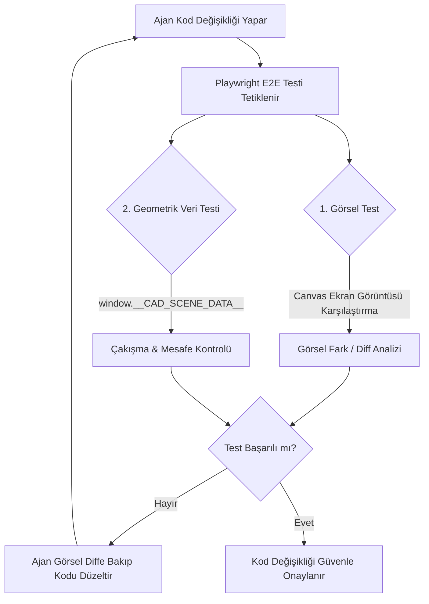

# 3D CAD Yapay Zeka Geliştirme ve Test Çerçevesi Raporu

Bu rapor, @[d:\CoreAlign](file:///d:/CoreAlign) projesinde yer alan 3D Cam Mekan Tasarımcı modülünün yapay zeka ajanları (AI Agent) tarafından otonom olarak geliştirilmesi, test edilmesi ve görsel/matematiksel hataların kendi kendine giderilebilmesi için kurulması gereken doğrulama altyapısını ve metodolojisini açıklamaktadır.

---

## 1. Amaç (Goal)

3D CAD ve WebGL (Three.js/React Three Fiber) tabanlı grafik sistemleri, doğası gereği geleneksel metin tabanlı doğrulama yöntemleriyle test edilmesi zor yapılardır. Bu projede hedeflenen amaçlar şunlardır:

- **İletişim Bariyerini Aşmak:** Kullanıcıların 3D sahnedeki görsel bozuklukları (örneğin iki parça arasındaki milimetrik hizalama hatalarını, çakışmaları veya rotasyon sapmalarını) uzun metinler yerine görseller/işaretlemeler üzerinden ajana aktarabilmesi.
- **Otonom Kod Geliştirme Döngüsü:** Yapay zeka ajanının, 3D çizim mantığı veya geometri hesaplamalarında yaptığı değişikliklerin çıktısını kendi kendine görebilmesi ve doğrulayabilmesi.
- **Hata Regresyonunu Önlemek:** Render motorunda yapılan bir optimizasyonun veya matematiksel bir değişikliğin, mevcut çizim tasarımlarını bozup bozmadığını otomatik testlerle tespit etmek.

---

## 2. Yapılmak İstenenler (Objectives)

Hedeflenen entegrasyon üç temel sacayağından oluşmaktadır:

1. **Görsel Regresyon Testleri (Visual Regression Testing):** Canvas elemanının ekran görüntüsünü alıp referans görüntülerle ("Golden Images") piksel hassasiyetinde karşılaştırmak.
2. **Semantik Sahne Denetimi (Data-Driven Scene Auditing):** 3D sahne ağacındaki nesnelerin konum, açı ve boyut gibi nümerik değerlerini test ortamına açarak matematiksel doğrulamalar yapmak.
3. **Çoklu Modlu Ajan Geri Besleme Döngüsü (Multimodal Agentic Feedback Loop):** Ajanın tarayıcı alt ajanlarını (`browser_subagent`) ve görsel algılama yeteneklerini kullanarak sahneyi incelemesi ve hata tespiti yapması.

---

## 3. Çözüm Mimarisi (Solution Architecture)



### 3.1. Görsel Regresyon Altyapısı

Playwright, test sırasında 3D `<canvas>` etiketini yakalayarak daha önce kaydedilmiş olan referans görsel ile karşılaştırır. Fark bulunması durumunda satır satır piksel bazlı görsel rapor üretir.

### 3.2. Sahne Verisi İhracatı (Scene Metadata Export)

Uygulama geliştirme (`development`) veya test (`E2E`) modundayken, React Three Fiber sahne grafiğini tarayıcının `window` nesnesi üzerinden dışarıya aktarır. Böylece test otomasyonu, sahneyi sadece görsel olarak değil, aynı zamanda matematiksel olarak da denetleyebilir.

---

## 4. Uygulama Adımları ve Örnek Kodlar

### Adım 1: React Three Fiber Sahne Verisi Aktarıcı Bileşeni

Aşağıdaki bileşen, 3D viewport içerisine yerleştirilerek sahnedeki nesnelerin durumunu Playwright'ın erişimine sunar:

```tsx
import { useThree } from '@react-three/fiber';
import { useEffect } from 'react';
import * as THREE from 'three';

export function SceneDataExporter() {
  const { scene } = useThree();

  useEffect(() => {
    if (process.env.NODE_ENV === 'development' || (window as any).__E2E_TESTING__) {
      (window as any).__CAD_SCENE_DATA__ = () => {
        const components: any[] = [];
        scene.traverse((obj) => {
          if (obj.name === 'glass-panel' || obj.name === 'profile-hardware') {
            const box = new THREE.Box3().setFromObject(obj);
            const size = new THREE.Vector3();
            box.getSize(size);

            components.push({
              name: obj.name,
              position: [obj.position.x, obj.position.y, obj.position.z],
              rotation: [obj.rotation.x, obj.rotation.y, obj.rotation.z],
              size: [size.x, size.y, size.z],
            });
          }
        });
        return components;
      };
    }
  }, [scene]);

  return null;
}
```

### Adım 2: Playwright Entegrasyonu ve Test Tasarımı

Bu dosya, hem görsel olarak canvas tutarlılığını hem de parçaların birbirine göre konum doğruluğunu denetler:

```typescript
import { expect, test } from '@playwright/test';

test('Tasarımcı 3D modeli doğruluğu', async ({ page }) => {
  await page.goto('/dashboard/glass-enclosure/projects/test-project-id');

  await page.evaluate(() => {
    (window as any).__E2E_TESTING__ = true;
  });

  const canvas = page.locator('canvas').first();
  await expect(canvas).toBeVisible({ timeout: 15000 });

  await expect(canvas).toHaveScreenshot('cad-designer-baseline.png', {
    maxDiffPixelRatio: 0.02,
  });

  const sceneData = await page.evaluate(() => (window as any).__CAD_SCENE_DATA__());

  expect(sceneData.length).toBeGreaterThan(0);

  const panels = sceneData.filter((item: any) => item.name === 'glass-panel');
  if (panels.length >= 2) {
    const p1 = panels[0];
    const p2 = panels[1];
    const xDistance = Math.abs(p1.position[0] - p2.position[0]);
    expect(xDistance).toBeGreaterThan(10);
  }
});
```

---

## 5. İş Akışı ve Geliştirme Yöntemi

1. **Görsel Geri Bildirim Sağlama:**
   3D çizim ekranında tespit ettiğiniz hatanın ekran görüntüsünü alın, sorunlu bölgeyi işaretleyip ajana gönderin. Çoklu modlu yapay zeka modeli resmi inceleyerek bileşenlerin açısal veya konumsal kaymalarını yorumlayacaktır.

2. **Kendi Kendine Düzeltme (Self-Correction) Döngüsü:**
   Ajan kodu değiştirdikten sonra E2E test komutunu (`npm run e2e`) arka planda çalıştırır. Test hata verirse, oluşan diff görsellerini tarayarak hatanın yönünü (örneğin X ekseninde 5px sola kayma var) tespit eder ve kodu bu doğrultuda günceller.

3. **CI/CD Entegrasyonu:**
   Görsel testlerin işletim sistemleri arasındaki font veya ekran kartı render farklarından etkilenmemesi için testlerin Docker konteynerleri üzerinde veya CI pipeline'ında (GitHub Actions) aynı sanal makinede koşturulması kararlılık sağlayacaktır.
