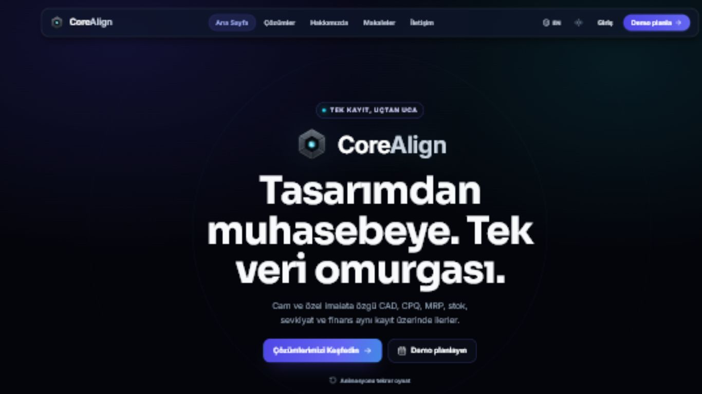
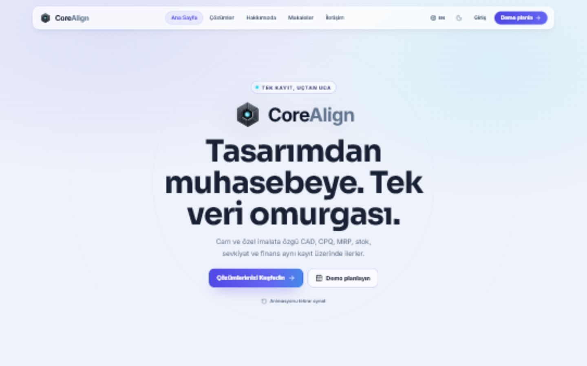
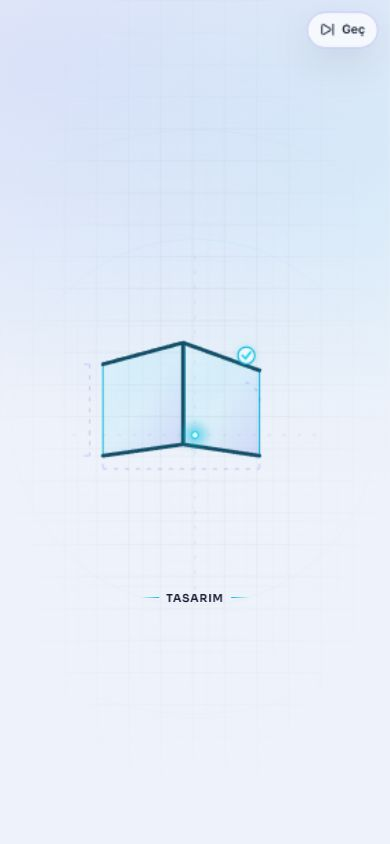
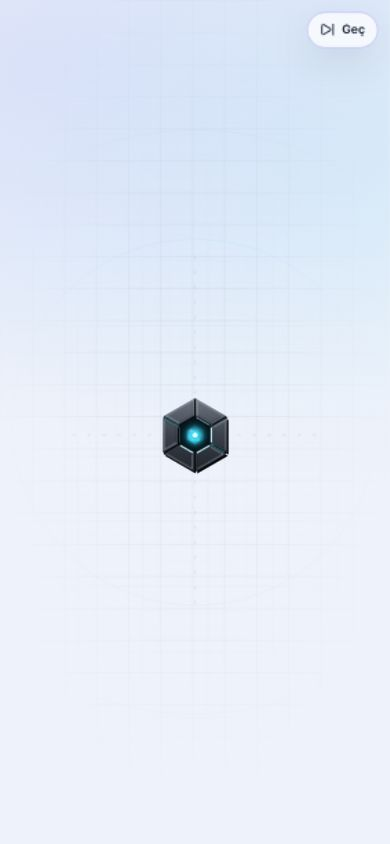
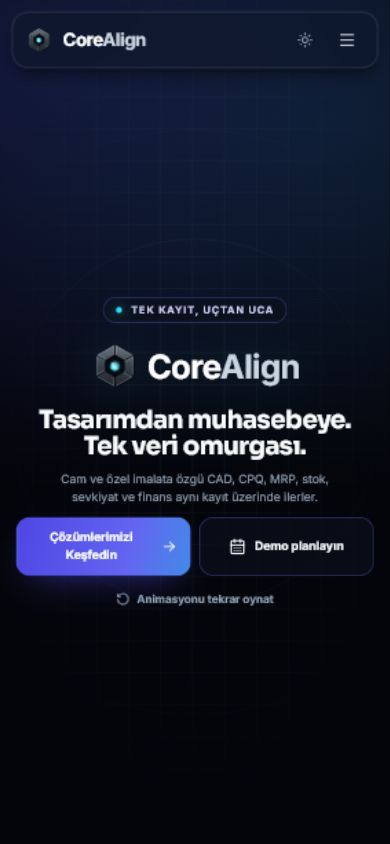
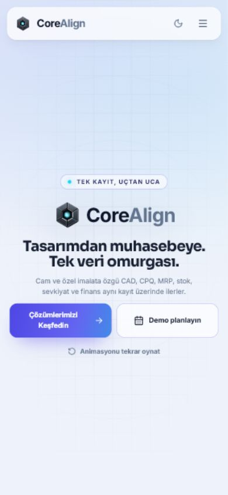

# CoreAlign landing intro — üretim notları

## Nihai storyboard

| Zaman     | Sahne           | Görsel dönüşüm                                                                    |
| --------- | --------------- | --------------------------------------------------------------------------------- |
| 0.00–0.45 | Sistem uyanışı  | Blueprint zemin, altı eksen izi ve tek cyan çekirdek                              |
| 0.45–1.25 | Sipariş ve ölçü | Sipariş kapsülü, ölçü düğümü ve 1200 mm / 2100 mm / 90° teknik işaretleri         |
| 1.25–2.55 | Tasarım         | Cyan hattın çizdiği L biçimli cam geometri, profil, ölçü ve doğrulama             |
| 2.55–3.60 | Teklif & BOM    | Cam geometrisinin üç malzeme satırlı teklif/BOM yüzeyine morfu                    |
| 3.60–5.05 | MRP & Üretim    | Kart sınırlarının nesting levhasına dönüşmesi, temper ritmi ve tamamlanan iş emri |
| 5.05–6.15 | Sevkiyat        | Levhanın kasaya morfu ve depo–araç–teslim hattı                                   |
| 6.15–7.20 | Muhasebe        | Teslim belgesinin fatura/yevmiye formuna dönüşmesi ve dengeli kayıt               |
| 7.20–8.20 | Core + Align    | Altı metalik segmentin gerçek CoreAlign işaretinde kilitlenmesi                   |
| 8.20–9.00 | Kalıcı hero     | Canonical işaretten wordmark, DOM sloganı, CTA’lar ve navbar’a geçiş              |

Sekans tek sefer oynar; bütün aşamalar aynı cyan kayıt ve tek path morfu ile birbirine bağlıdır.

## Responsive kompozisyon

- Masaüstü sahnesi: 16:9 (`0 0 1200 675`), yatay akış ve izometrik derinlik.
- Mobil sahne: 9:16 (`0 -210 900 1600`), merkezde morf ve nesne altı etiket.
- `100svh` + `100dvh`, safe-area insetleri ve ultrawide maksimum sahne genişliği uygulanır.
- Test matrisi: 320×568, 360×800, 390×844, 430×932, 768×1024, 1366×768, 1440×900, 1920×1080, 2560×1440 ve 3440×1440.
- Bütün ölçümlerde yatay taşma `0`; hero tam viewport yüksekliğinde kaldı.

## Oynatma ve erişilebilirlik

- Oturum anahtarı: `corealign:landing-intro:v1`.
- Skip, Escape, sahne tıklama/dokunma ve doğal scroll final hero’ya geçirir.
- Sekme görünmezken JS zamanlayıcıları, CSS animasyonları ve SVG SMIL birlikte durur.
- 9 saniye complete, 10.5 saniye güvenlik zaman aşımı vardır.
- `prefers-reduced-motion`, Save-Data, 3G ve altı bağlantı ile düşük cihaz kapasitesinde statik hero/poster kullanılır.
- Oynatma sırasında görünmeyen hero kontrolleri `inert`; doğal tamamlanmada ikinci fade oluşmaz.
- Dekorasyon `aria-hidden`; bölümün kısa bir erişilebilir adı ve açıklaması vardır.

## Dil ve marka

- Aşama etiketleri, slogan ve CTA’lar TR/EN JSON’dan gerçek DOM metni olarak gelir.
- `/` ilk renderda Türkçe, `/en` ilk renderda İngilizce kaynağı yükler.
- Kilitlenme anı `corealign-mark.svg` koordinatlarını, metal brush katmanlarını ve gerçek SVG asset’ini kullanır.
- Harici font, iframe, ikinci React runtime, yeni motion/3D bağımlılığı veya CDN eklenmedi.

## Boyutlar

| Kaynak                                         |       Ham |     Gzip |
| ---------------------------------------------- | --------: | -------: |
| Intro TSX + CSS + tercih yardımcısı + iki AVIF |  66,207 B | 15,588 B |
| Mevcut canonical logo dahil                    |  73,239 B | 17,052 B |
| Üretim LandingPage JS chunk                    | 247.36 kB | 54.85 kB |
| Üretim LandingPage CSS chunk                   |  23.43 kB |  5.13 kB |
| `poster-dark.avif`                             |     735 B |        — |
| `poster-light.avif`                            |     671 B |        — |

## Doğrulama özeti

- ESLint: geçti.
- Hedefli Vitest: 13/13 geçti.
- Prettier ve landing kapsamlı `git diff --check`: geçti.
- Vite üretim paketi: geçti; 4,130 modül.
- SEO prerender: geçti; 10 route/locale HTML + sitemap.
- Tam `npm run build`, landing dışındaki mevcut manufacturing TypeScript hatalarında duruyor. Intro dosyalarında TypeScript/Vite hatası yok.
- Genel bundle-budget kontrolü, mevcut `vendor-geo` ve `GlassProjectDesignerPage` chunk’ları nedeniyle başarısız; LandingPage chunk’ı kendi bütçesinde geçti.

## Referans renderlar

